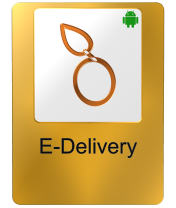

# Demosty (Open Companies)
Welcome to Demosty, where we're redefining the future with Open Companies – a decentralized, empowering, modular, open, shared, and transformative approach to collaborative development.

# Overview
## Demosty stands for:

• **Decentralized:** Shifting away from traditional corporate structures, Demosty fosters a decentralized ecosystem where developers globally contribute to a shared codebase.

• **Empowerment:** Empowering developers to build and run their businesses using a common platform, challenging the conventional models of employment.

• **Modular:** Embracing a modular approach, Demosty encourages the creation of diverse components, from popular domain open source companies to impossible challenge projects.

• **Open:** An open invitation to developers worldwide to contribute, innovate, and collaboratively shape the future of business and technology.

• **Shared:** A shared vision and codebase that unites developers across borders, creating a network of interconnected companies under the Demosty umbrella.

• **Transformative:** Transforming the landscape by challenging existing paradigms, encouraging entrepreneurial spirit, and fostering a global community.

• **Yielding:** Active participation in Demosty yields benefits - whether contributing to popular domain companies, challenging well-known giants, or attempting the impossible.

# Vision
In a world grappling with economic challenges, job layoffs, and concerns about AI's impact, Demosty emerges as a vision for change. Born out of the belief that technology can be a force for empowerment and inclusivity, Demosty addresses these pressing issues head-on. Our vision is to create a global community of developers, designers, and skilled individuals who collaboratively build open companies, transcending geographical boundaries.

## Why Demosty?
**Poverty Alleviation:** Demosty aims to lower poverty by providing opportunities for individuals of all skill levels. By fostering a community-driven approach, we believe in creating jobs and empowering individuals worldwide.

**Job Security:** Say goodbye to the fear of job layoffs. Demosty puts control back into the hands of developers, allowing them to contribute, innovate, and build their own businesses.

**AI Collaboration, Not Fear:** Demosty transforms the narrative around AI. Instead of fearing job displacement, we encourage collaboration to harness the power of AI for meaningful and empowering purposes.

**Open Company Model:** The open company model challenges traditional corporate structures, offering an alternative where contributors become entrepreneurs, building and running their businesses based on a shared codebase.

**Inclusive Collaboration:** Demosty invites every developer, designer, and individual with a skill set to contribute. The shared success of the community forms the foundation for a more inclusive and sustainable future.

# Expectations / Roadmap
## Company Final Products
For every company within Demosty, our goal is to provide a final product ready for users to set up their businesses with just one click. Whether you're interested in e-delivery, generative AI, or calculators, each company's final product will be thoroughly documented, ensuring a seamless transition from code to administration.

## Detailed Documentation
Expect detailed documentation for each company, covering every aspect from code sections to administration levels. This documentation aims to empower users to understand, customize, and efficiently operate their businesses.

## Roadmap Ahead
Our roadmap includes expanding the portfolio of popular domain open source companies, tackling challenging companies, and venturing into seemingly impossible challenges. We foresee a dynamic community, continually innovating, and pushing the boundaries of what's achievable.

# Sections:
## Popular Domain Open Source Companies:
Explore a variety of popular domain open source companies, including e-delivery, generative AI, calculators, and more. Each represented by an image card leading to its respective main open company repository.

  
  
  
  
   
  
  
  
  

## Challenging Companies:
Prove your skills by enhancing, designing, producing, or developing at least one part, module, or section of well-known companies. Your improved version, known as a "berry," is a testament to community-driven innovation. Click on company cards like Google, Microsoft, Amazon, etc., to discover how to contribute.

 // coming card will be displayed here //
 
## Impossible Challenge Projects:
Embark on impossible challenges, from converting 2 bytes to 1 byte to solving the traveling salesman problem. Explore these cards for ambitious endeavors that push the boundaries of what's deemed possible.

// coming card will be displayed here //
